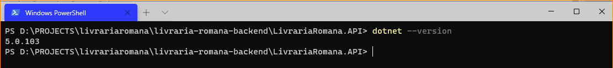
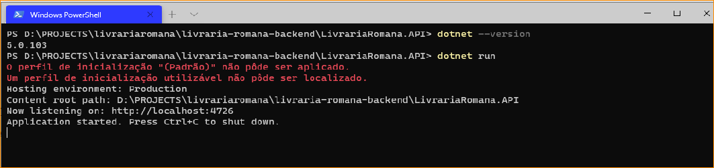
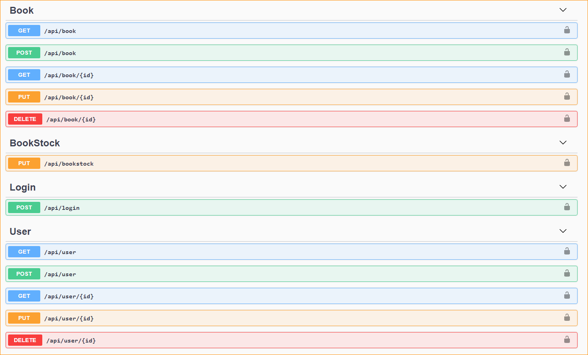
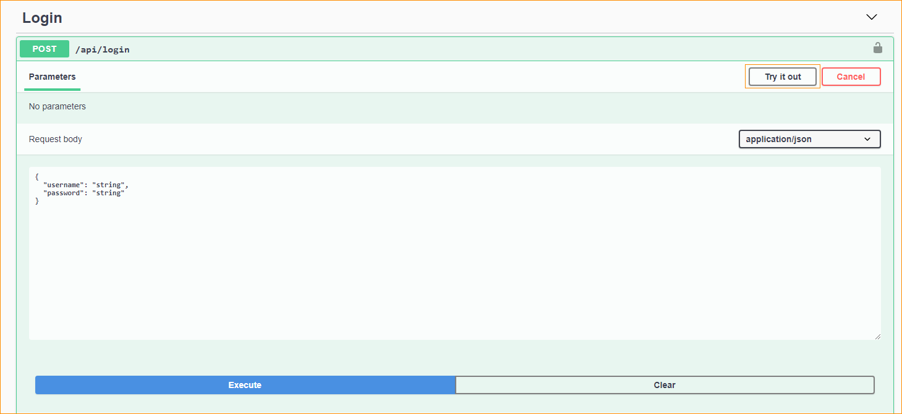

# Livraria Romana Backend (ASP.NET CORE 3.1)
Este projeto foi desenvolvido para uma avaliação e estudos. Tem como objetivo controlar o estoque de livros de uma determinada livraria. 

## Iniciando
- Clone o projeto:
    ```bash
        git clone https://github.com/amdlemos/livraria-romana-backend.git
    ```
### Visual Studio 2019
- Abra o Visual Studio e vá em File > Open > Solution, e selecione a solução clonada.
- Vá nas propriedades da solução e defina LivrariaRomana.API como projeto principal.
- De um Build (ctrl+shift+b)na solução e após isso é só rodar com ctrl+F5 ou somente F5 caso queira debugar o código.

### CLI
- Para usar a CLI é necessário que você tenha o MSBuild instalado. Baixe a ferramenta de build em: https://visualstudio.microsoft.com/pt-br/thank-you-downloading-visual-studio/?sku=BuildTools&rel=16
- Execute o arquivo e selecione as ferramentas de Build necessárias.
    - Ferramentas de build de desenvolvimento Web.
    - Ferramentas de build de processamento e armazenamento de dados.
    - Ferramentas de build do .NET Core.
- Após as ferramentas serem instaladas reinicie o computador e entre no PowerShell ou Prompt de Comando e digite: 
```bash
dotnet --version.
```
Você deverá receber a versão instalada conforme abaixo: 

- Uma vez que o dotnet esteja instalado e o projeto baixado em seu computador, basta acessar a basta do projeto LivrariaRomana.API e digitar:
```bash
dotnet build
dotnet run
```
Se tudo estiver ok será informado a porta em que o sistema está rodando.


## Swagger
- O Swagger é inicializado na raiz da aplicação: http://localhost:4726/. 
- Ao acessar o Swagger você terá as rotas disponíveis: 

- Para ter acesso a todos os recursos da API você precisa estar logado, acesse a rota correspondente ao login em LOGIN > POST, cliem em Try it out, preencha os dados de login (usuário e senha) e então click em Execute. O Swagger irá fazer o Request para  a API e lhe apresentar a Resposta. 

- Caso seja o seu primeiro acesso e esteja tudo OK a API irá criar um usuário para você com as informações passadas anteriormente e lhe fornecera um Token de acesso. 

- TODO: explicar com mais detalhes como utilizar.

## Utilizando a Aplicação
- Para criar o primeiro usuário faça um post em Login pelo Swagger com o usuário e senha desejados que o sistema ira criar um usuário "admin" para você. 
- Na resposta vai ser lhe informado seu token.
- Na parte direita do Swagger há um botão Authorize, click e adicione ao campo a palavra Bearer + token, desta forma você irá adicionar o token ao seu request.
- Usuários que não possuam Role "admin" terão as mesmas permissões de usuários não logados.
- Agora você já pode utilizar as outras rotas da API.   

## Controlando o estoque
- Primeiramente você deve adicionar um livro no banco.
- Após ter sido feita a inclusão você irá usar o BookStockController para consumir o serviço que atualiza o estoque, não é possível alterar a quantidade de livros diretamente pela edição de livros. 

## Pacotes Utilizados
- AutoMapper v9.0.0
- FluentAssertion v5.10.0
- FluentValidation v8.6.1
- NLog.Extensions.Loggin v1.6.1
- Swashbuckle.AspNetCore v5.0.0
- System.IdentityModel.Tokens.Jwt v5.6.0
- Utf8Json v1.3.7
- Konsciou.Security.Cryptography.Argon2
- xunit v2.4.0
- xunit.runner.visualstudio v2.4.0
- coverlet.collector v1.0.1  

## Configurando a Aplicação
### Banco de Dados (SQL SERVER 2017)
#### Criando o banco de dados

- MIGRATION: No console de gerenciador de pacotes, no projeto LivrariaRomana.Infrastructure, voce deve utilizar o comando abaixo:
```bash
update-migration
```
- SCRIPT-SQL: Rodar o script abaixo no banco desejado:
```sql
IF OBJECT_ID(N'[__EFMigrationsHistory]') IS NULL
BEGIN
    CREATE TABLE [__EFMigrationsHistory] (
        [MigrationId] nvarchar(150) NOT NULL,
        [ProductVersion] nvarchar(32) NOT NULL,
        CONSTRAINT [PK___EFMigrationsHistory] PRIMARY KEY ([MigrationId])
    );
END;

GO

CREATE TABLE [Books] (
    [Id] int NOT NULL IDENTITY,
    [Title] nvarchar(max) NULL,
    [OriginalTitle] nvarchar(max) NULL,
    [Author] nvarchar(max) NULL,
    [PublishingCompany] nvarchar(max) NULL,
    [ISBN] nvarchar(max) NULL,
    [PublicationYear] nvarchar(max) NULL,
    [Amount] int NOT NULL,
    CONSTRAINT [PK_Books] PRIMARY KEY ([Id])
);

GO

CREATE TABLE [Users] (
    [Id] int NOT NULL IDENTITY,
    [Username] nvarchar(max) NULL,
    [Password] nvarchar(max) NULL,
    [Hash] nvarchar(max) NULL,
    [Salt] nvarchar(max) NULL,
    [Email] nvarchar(max) NULL,
    [Role] nvarchar(max) NULL,
    CONSTRAINT [PK_Users] PRIMARY KEY ([Id])
);

GO

INSERT INTO [__EFMigrationsHistory] ([MigrationId], [ProductVersion])
VALUES (N'20200126171823_create_database', N'2.2.0-rtm-35687');

GO
```

#### Configurar Connection String
- Configure a Connection String em app.settings.json, não se esqueça de fazer a mesma configuração no projeto de testes de repositório e serviços. Os testes da API (integração e autorização) utilizam banco de dados na memória.
  
```bash

{  
  "AllowedHosts": "*",
  "ConnectionStrings": {
  "DevConnection": "Password=123;Persist Security Info=True;User ID=sa;Initial Catalog=LivrariaRomana;Data Source=PC_ALAN"
}
```

### Log
- Configure o arquivo nlog.config no projeto LivrariaRomana.API, indicando o caminho onde será salvo o Log.  
 
## Rodando os testes
- Não se esquecer de copiar o arquivo "/nlog.config" para o projeto de testes da API.
- Implementei uma transaction nos testes de repositório e serviços para que o banco esteja sempre vazio antes dos testes. 
- Lembrando, os testes da API utilizam banco de dados na memória.
